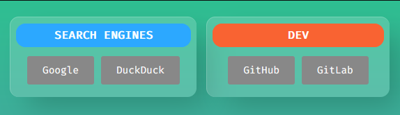
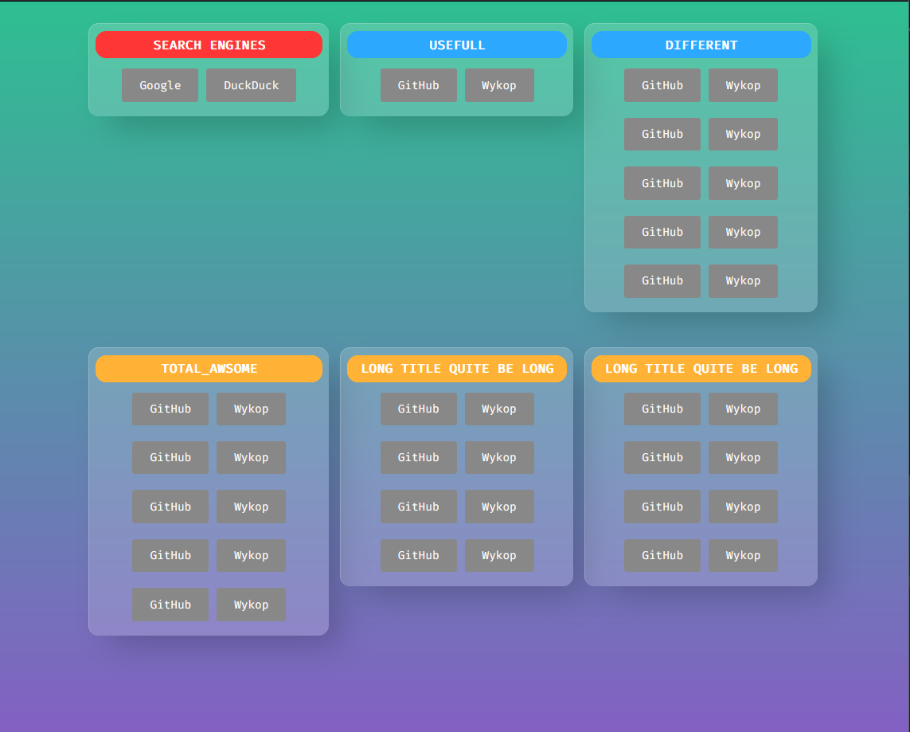

# Links Dashboard

It is a generator of link's dashboard. Based on input from YAML file, single static website is generated.



## Example

### Output



### Input

```yaml
---
name: "Dashboard"
navbar:
  - name: Python
    notes: "Short note which appear as a tooltip."
    url: https://www.python.org/
sections:
  - name: Search Engines
    notes: "Search Engines section description"
    links:
      - name: Google
        notes: "Google. Short note which appear as a tooltip."
        url: https://google.com
      - name: DuckDuckGo
        notes: "DuckDuckGo. Short note which appear as a tooltip."
        url: https://duckduckgo.com/
  - name: VCS
    notes: "VCS Section description"
    links:
      - name: GitHub
        notes: "GitHub. Short note which appear as a tooltip."
        url: https://github.com
      - name: GitLab
        notes: "GitLab. Short note which appear as a tooltip."
        url: https://gitlab.com
```

## How to use

1. Install requirements
     -   `pyproject.toml` -> `poetry install` 
     -   `requirements.txt` -> `pip install requirements.txt`

2. Create or edit `links.yaml` file. Add your own data.
     - You may use template file to do that: `.\links.yaml.template`
     - Data schema can be found in `board_generator`

3. Once filled, execute `python .\script.py`
   - Dashboard is generated at `.\dashboard\dashboard.html`


## Template

Page is generated using `Jjinja` templating engine. It consists of files:

-   `base.html` - Main file, include the rest ones.
-   `cards.html `- Whole content is here. Display cards with links inside.
-   `footer.html` - Bottom *navbar*. 
-   `nav.html` - Navigation bar.

## Look & Theme

Bootstrap theme is used: **Now-UI Kit**. Few links which might get be useful.

-   https://github.com/creativetimofficial/now-ui-kit

-   https://demos.creative-tim.com/now-ui-kit/docs/1.0/getting-started/introduction.html?ref=adnp-readme

#### Custom CSS

All custom styles are in `.\dashboard\assets\css\custom.css` file.

## Data schema

Definition of an input data file structure.


```python
Color = Literal['Primary', 'Secondary',
                'Success', 'Danger',
                'Warning', 'Info',
                'Light', 'Dark']


class Link(TypedDict,
           total=False):
    """
    Single link, shown as a button.

    Args:
        name: Text inside button.
        url: Any address (supported by web-browser).
        notes: Additional information in tooltip.
            Default: None.
        color: Color of a button.
            Default: Secondary.
    """
    name: str
    url: str
    notes: str
    color: Color


class Section(TypedDict,
              total=False):
    """
    Box (Bootstrap's Card) with Button links.

    Args:
        name: Title of a Card.
        notes: Additional information in tooltip.
            Default: None
        color: Color of a Card's header/title.
            Default: Primary.
        links: List of `Link`s to put inside.
    """
    name: str
    notes: str
    color: Color
    links: List[Link]


class Board(TypedDict,
            total=False):
    """Represent the Dashboard.

    Attrs:
        name: Name of the page. Also placed in navbar and in page title.
            Default: Dashboard
        navbar: List of `Link`s to put in navbar section.
            Default: []
        sections: List of `Section`s.
            Default: []
    """
    name: str
    navbar: List[Link]
    sections: List[Section]
```

#### Colours

Default BS's *colours* are used: `Primary, Secondary, Success, Danger, Warning, Info, Light, Dark`

>   Usually, such definitions helps me not to remember the data structure's names I'm working with. The IDE's hints take care of that but I did not foresee one thing. 
>   Referencing a variable in Jinja template is a, lets say, context less. It doesn't *know* about Python's objects.
>
>   Nevertheless, it is a good reference point, how the data in YAML should look like.


## How to edit

In order to change a dashboard look, you may:

### Adjust `custom.css`

Go to `./dashboard/assets/css/custom.css` file and change the CSS settings.

### Adjust template

Go to `./template` folder and change desire Jinja templates.